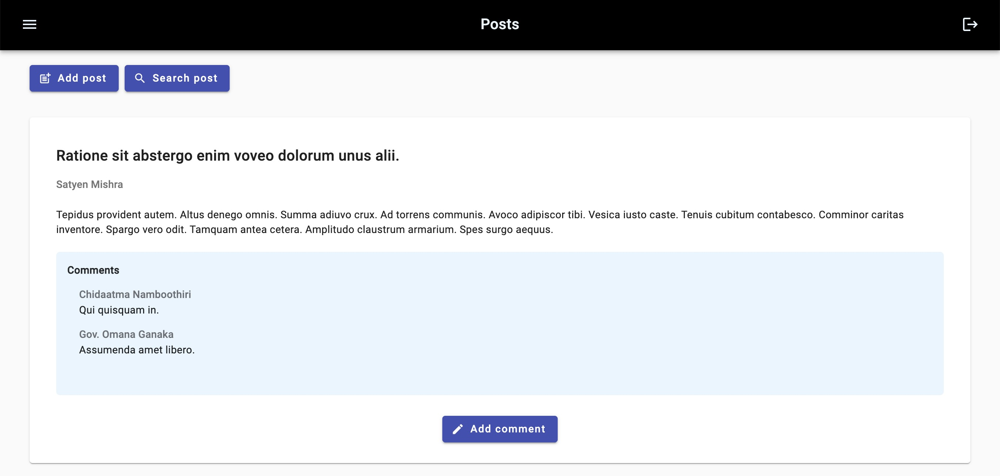

# Angular Social


## Description
Angular Social is a basic simulation of a social network powered by [Go REST](gorest.co.in), designed with Angular, HTML, CSS and Angular Material. It is organized into modules, and uses routes guard and lazy loading.



## Installation
If you're using OS X or Windows, use one of the installers from the [Node.js download page](https://nodejs.org/en/download/). LTS versions of Node.js are recommended.

Then, you can install the Angular CLI:
```bash
npm install -g @angular/cli
```

Now run `ng serve` for a dev server. Navigate to http://localhost:4200/. The application will automatically reload if you change any of the source files.

`ng build` only executes the builder for the build target in the default project as specified in angular.json. 

## Usage
The first thing Angular Social will ask you to do is log in via an email and an access token. If this is your first access then you can choose to register (with the exception of the token, the data must not be real but at least in the correct format). The registration page will ask you to retrieve the token by directing you to the Go Rest website, where you can log in through a Github, Google or Microsoft account. At this point you should open the Access Token section, alternatively you can open the drop-down menu at the top right and open API Tokens. Now you can copy the access token and paste it into the Angular Social registration form. Once you have registered successfully, you can log in.  
The first page displayed is the list of users, at the bottom through the paginator you can see the total number of users, choose how many to display on each page and obviously turn the page. In this section you can add, search and delete users.
By selecting a user it will be possible to go to the user detail section, where in addition to the basic information you will also be able to see their posts (if there are any) and add comments.  
At the top left of the toolbar you can access the menu and select the post list section. Here too the paginator will allow you to view the total posts and manage the page, furthermore here too it is possible to add posts, search for a post by title, and add comments.
Finally, at the top right of the toolbar you can log in.

## Features
- Add user, search user by name or email, delete user
- Consult the user's details with their posts
- Add post, search post by title, write comments
- Powered by Go REST

## Demo
You can try Angular Social website [here](https://angular-social.netlify.app)